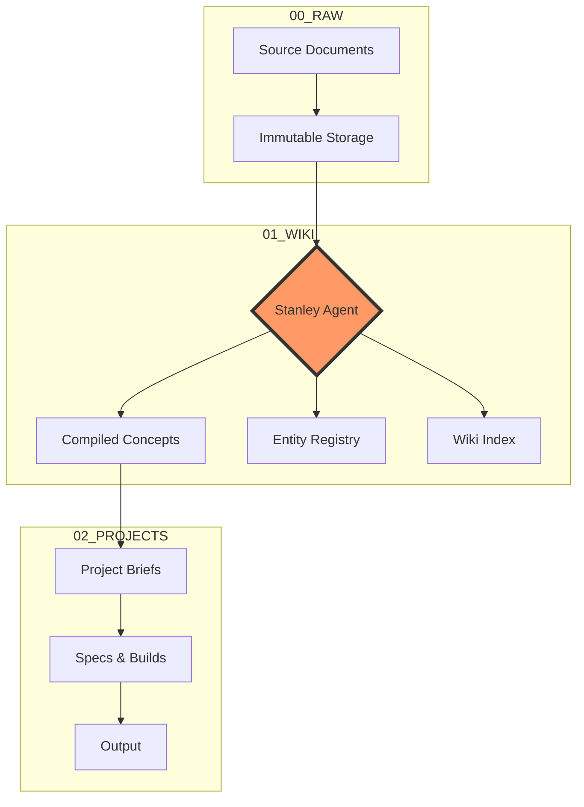

# 🏛️ Stanley: The Sovereign Intelligence Engine


> *"Knowledge doesn't compound in a graveyard. It compounds in an engine."*

**Stanley** is an AI-native Obsidian vault designed for **Knowledge Compounding**. It rejects the traditional "knowledge graveyard" effect of passive note-taking in favor of a proactive, self-sustaining intelligence engine that compiles raw data into specialized wiki artifacts.

---

## ✨ Key Pillars

### 🔐 Sovereign & Privacy-First
Stanley is 100% local-first. Your data, your models, your keys. It operates using local LLMs and private contexts to ensure that your most valuable insights never leave your machine.

### 📈 Knowledge Compounding
Most notes are static. Stanley’s three-layer architecture ensures that every new source builds upon existing concepts, creating a "Karpathy-style" LLM Wiki that grows in utility over time.

### 🤖 Agent-Managed Logic
Stanley isn't just a folder structure; it's an operating system for your AI agents. With pre-defined schemas and skills, Stanley manages the "bookkeeping" of your knowledge base so you can focus on synthesis.

---

## 🏗️ The Architecture

Stanley operates on a three-layer pipeline to ensure your knowledge is compiled, not just retrieved.



---

## 🚀 Getting Started

1. **Clone the Engine**: 
   ```bash
   git clone https://github.com/mattsclimate/Stanley-Vault.git
   ```
2. **Open in Obsidian**: Point Obsidian to the root of the cloned directory.
3. **Initialize the Agent**: Open `me.md` and define your portable context.
4. **Feed the Engine**: Drop your PDFs, transcripts, or notes into `00_RAW/` and watch your wiki emerge.

---

## 🛠️ The Toolkit

- **[Portable Context](me.md)**: Your first principles and agent alignment.
- **[Wiki Skills](skills/SKILL.md)**: Standardized workflows for the LLM Wiki.
- **[Schema](stanley.md)**: The "OS" logic for agentic interaction.

---

## 🏛️ Origins
Stanley was built for those who seek maximum leverage from their personal knowledge. It is designed to be the definitive base for anyone building a private, compounding intelligence system.

**Built by [username]]. Powered by Stanley.**
