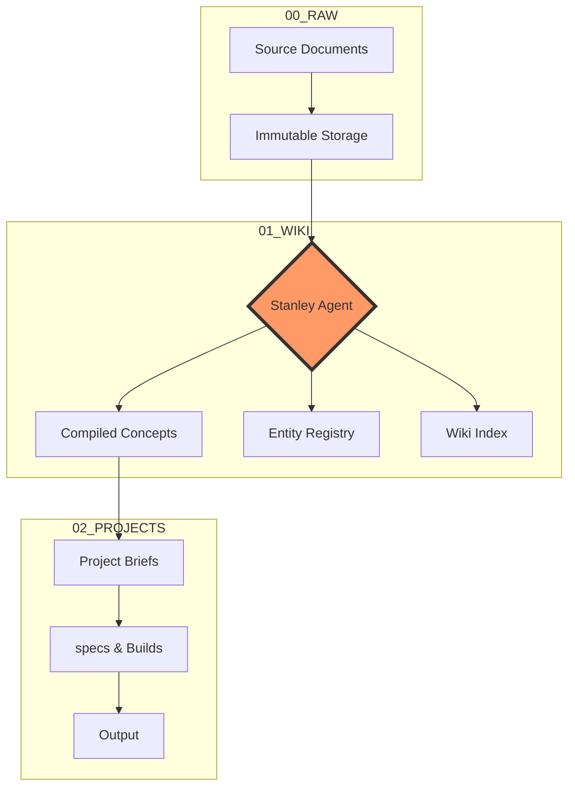

# 🏛️ Welcome to Stanley

Welcome to your **Sovereign Intelligence Engine**. Stanley is a self-sustaining personal knowledge base designed for **Knowledge Compounding** and **Sovereign Intelligence**.

---
## 🏗️ System Architecture
Stanley operates on a three-layer pipeline to ensure your knowledge is compiled, not just retrieved.

---

## 🧭 Navigation
Start exploring your system through these core files:

- [[me.md|👤 Portable Context]]: Your first principles and preferences.
- [[vault_map.md|🗺️ Vault Map]]: Folder architecture and naming logic.
- [[stanley.md|🤖 Stanley Schema]]: The agent's operating procedures.
- [[skills/SKILL.md|🛠️ Wiki Skills]]: The technical workflow for the LLM Wiki.

---

## 🚀 Getting Started
To begin compounding your knowledge:

1. **Clip a Source**: Write or import notes into a topic folder in `00_RAW/`.
2. **Command Stanley**: Tell your agent: *"Ingest the latest source from 00_RAW into the wiki."*
3. **Explore**: Follow the links in the newly generated WIKI articles to discover hidden connections.
4. **Build**: Start a new project in `02_PROJECTS/` and let Stanley generate the initial Spec.

---

## 📈 Recent Activity
- **Current Status**: Vault Initialized.
- **Last Action**: Folder architecture established.
- **View Full History**: [[01_WIKI/log.md|Wiki Log]]

> [!IMPORTANT]
> Stanley is **100% local-first**. Your data never leaves this vault unless you explicitly export it.
